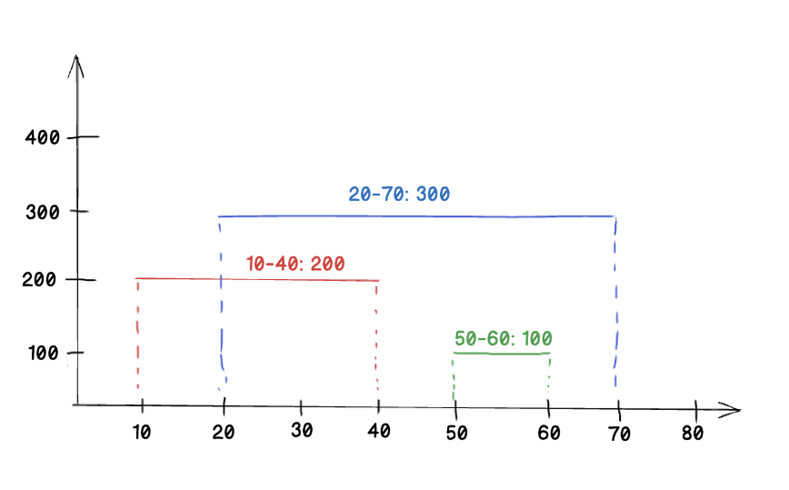

# Rain Collector

You're working on a system that records the rate of rain dropped by clouds over time.
You can tell this system that one or more clouds dropped rain for a time interval at a specific rate (the units do not matter).
For example: a cloud dropped rain between t=10 and t=20 dropping r=200 drops/second during that time. Consider the following scenario:



Here we recorded three clouds. The blue cloud rained between t=20 and t=70 at a rate of 300. The red cloud dropped rain at a rate of 200 between t=10 and t=40. The accumulator class would record this with the addRainRate method:

```javascript
addRainRate(20, 70, 300);
addRainRate(50, 60, 100);
addRainRate(10, 40, 200);
```

At any point, the system should be able to answer two questions:

1. `getRainRate(time)`: What was the rain rate at a specific time?
2. `getRainAccumulation(t0, t1)`: How much total rain was accumulated between t0 and t1?

For example, in the scenario above:

```javascript
getRainRate(15); // should return 200
getRainRate(80); // should return 0
getRainAccumulation(30, 60); // should return 12600
getRainAccumulation(25, 35); // should return 5500
```
